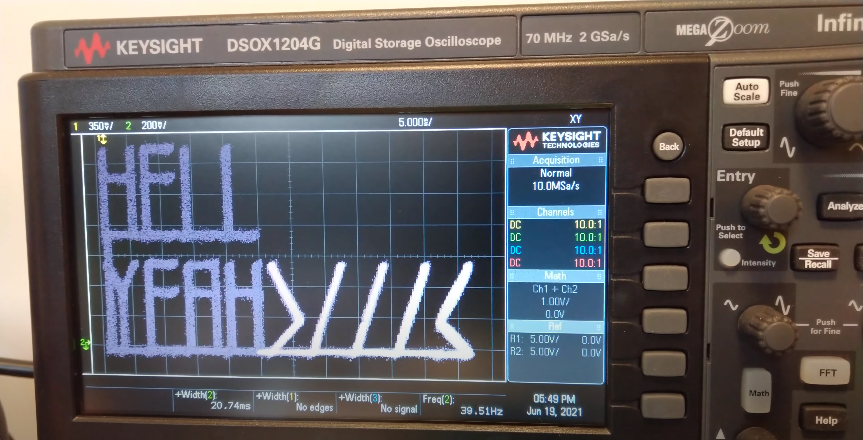
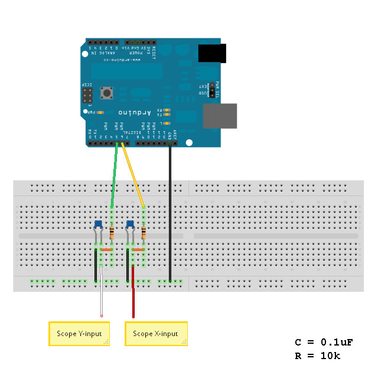

# Arduino Scope XY Text

Use Arduino to print words on oscilloscope in xy mode   

[YouTube](https://youtu.be/DNeIA9IsSRQ)  
[](https://youtu.be/DNeIA9IsSRQ)


## schematic


## How to use it
Change sentence you want on TEXT1, TEXT2
```c
#define WORD_CNT    (10)
#define TEXT1       ("YEAH>///<")
#define TEXT2       ("HELL")
``` 